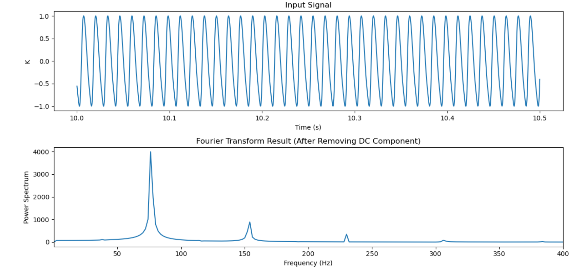

# ***FFT解析ツール（初心者による作成）***

これは、プログラミング初心者として初めて公開する Python 解析コードです。

私は熱対流とくに自然対流の研究をしており、このスクリプトは流れ場のカオス解析の際に、

空間平均運動エネルギーK(t) などの時系列データから卓越周波数を FFT により抽出するために作成しました。

プログラミングの専門家ではありませんが、

研究室のメンバーや将来の後輩たちが参考として使えるように、学びの過程も含めて公開しています。

**そのため、本READMEの手順や説明は “研究室内の学生向け” に分かりやすく書いています。**

## 📘 注意事項 

- 最適化されたコードではありません
- 同じ処理をより綺麗・高速に書く方法はたくさんあると思います
- 学びながら、少しずつ改良していく予定です
- ***ミスのご指摘、ご教授お待ちしております！***


## **🔧推奨環境**

### Jupyter Lab / Jupyter Notebook での実行を推奨します
これは、可視化が簡単にでき、研究室内PCであれば追加インストールなしにすぐに実行できるためです。

> (※ コマンドラインで　python fft_analysis.py　を使って実行することも可能です。)
>
>**必要なライブラリ**
> 
> - numpy
> - matplotlib
> - scipy
> 
> インストール（必要な場合）:
> 
> ```bash
> pip install numpy matplotlib scipy
> ```
> 


## 📝 手順

スクリプトを実行すると、次の入力が求められます：

1. **解析したいデータファイル（.txt）のパス**

2. **表示したい周波数範囲（fmin fmax）**

入力例:

```bash
0 400
```

プロットがうまく表示されない場合は、周波数範囲を変えて再実行してください。


### **解析に使用するファイルの形式**

テキストファイルは 2 列である必要があります:

```bash
0.0001  0.0123
0.0002  0.0131
0.0003  0.0140
```

- 1列目: time
- 2列目: signal value (例: K(t))


## 📊出力例

以下は sample_data を解析したときの例です：




この図には：

- 入力時系列データ
- DC成分除去後のパワースペクトル
- 卓越周波数のピーク

が含まれます。

## 📂 サンプルデータについて

sample_data フォルダに
レイリーベナール対流の 周期解 / 非周期解 のサンプルデータを用意しています。

FFT が正しく動くか試したい人、練習したい人

は、まずこのサンプルデータを使ってみてください。

